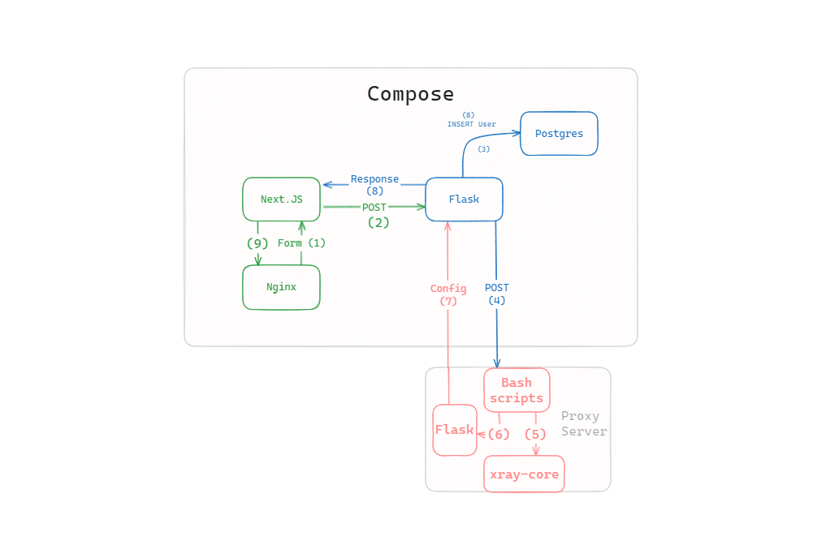

# SESCVPN
Данный учебный проект написан в качестве итогового проекта по НИС'у "Введение в облачные технологии". 

---

## Содержание
- [О нашем решении](#sol)
- [Инструкция по запуску]()
- [О протоколе xray и используемых технологиях]()
- [Архитектура решения]()
- [Контакты]()
---
<h2 id="sol"> Наше решение</h2>
В результате проекта была разработана IaaS платформа для упрощения создания обычного и реверс прокси. Всё решение состоит из веб сайта, прокси сервера и БД, для управления подключениями. На сайте можно получить конфигурацию для подключения прокси, причём для каждого клиента она будет отличаться.

<h2 id="instruction"> Инструкция по запуску</h2>
<h3>Зависимости</h3>
Для запуска проекта необходимо установить линукс (Ubuntu/Fedora/Debian/Arch/etc..), а также установить <a target="_blank" href="https://docs.docker.com/engine/install/">docker</a> и <a target="_blank" href="https://docs.docker.com/compose/install/linux/#install-using-the-repository">docker-compose</a> и настроить их, как указано в гайде.
<h3> Инструкция</h3>
Для запуска проекта необходимо скачать репозиторий со страницы или склонировать репозиторий с командой `git clone https://github.com/RechnoyBobr/sescvpn`.  
Далее, находясь в корне запустить сборку проекта командой `docker-compose build`. После сборки, запустить сервис, также находясь в корне проекта командой `docker-compose up`.  
На 80 порту находится фронтенд сервис: `http://localhost/`  
На 5050 порту находится pgAdmin для ручного управления БД: `http://localhost:5050`

<h2 id="arch">Архитектура</h2>
На данной диаграмме показана архитиектура сервиса. Рассмотрим, что будет происходит при отправке формы.

1, 2. Пользователь отправляет форму. Формируется пост запрос и отправляется на бэкенд сервер  
3. С данными из формы пользователя формируется запрос в БД для проверки существования этого пользователя. В случае существования записи в БД, последующие шаги выполняться не будут.  
4. В противном случае, отправляется пост запрос на прокси сервер.  
5. С помощью bash скриптов генерируются конфигурации для xray-core и выполняется перезагрузка контейнера с xray-core.  
6. Генерируется конфигурация для пользователя и сохраняется в файл. После этого запускается скрипт на питоне.  
7. С помощью скрипта формируется ответ на пост запрос из 4 пункта и отправляется на сервер.  
8. Из полученной конфигурации в БД добавляется запись вида email/uuid, а сама конфигурация отправляется на фронтенд.  
9. Конфигурация появляется на веб-сайте
